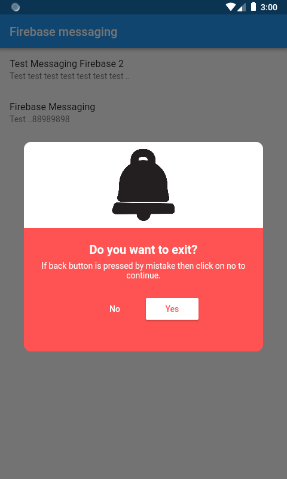
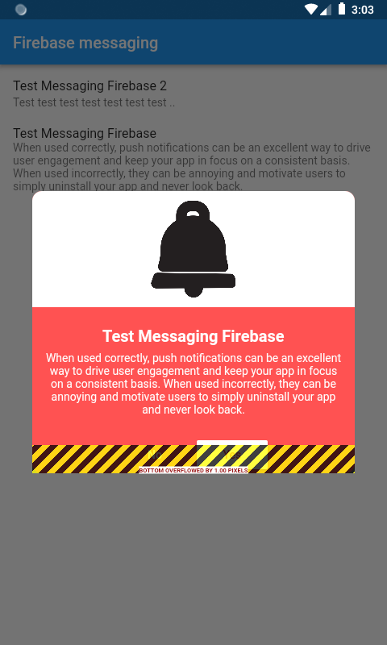
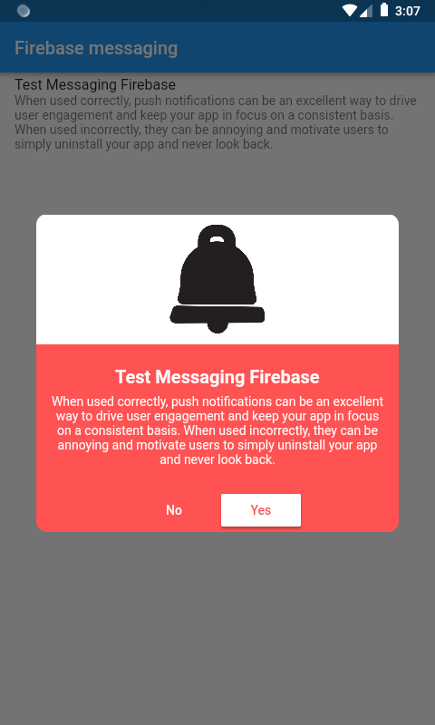

# Flutter Push Notification

A new push notification Flutter application.

## Getting Started

This project is a starting point for a Flutter Push Notification application with the Firebase CloudMessaging.

## FirebaseMessaging Configure functions :

    . onMessage: when the app in the forground
    . onResume : when the app in the background
    . onLaunch : when the app terminated

## Screens :

<table>
    <tr>
        <td style="padding:5px">
            
        </td>
        <td style="padding:5px">
            
        </td>
        <td style="padding:5px">
            
        </td>
    </tr>
</table>

## Ressources :

- Technical overview :

    https://flutter.dev/docs/resources/technical-overview

1. Easy Push Notifications with Flutter and Firebase Cloud Messaging :

    https://medium.com/@SebastianEngel/easy-push-notifications-with-flutter-and-firebase-cloud-messaging-d96084f5954f

- Firebase_messaging 6.0.16 (implementation in flutter) :

    https://pub.dev/packages/firebase_messaging#-installing-tab-

- Configuring APNs with FCM (iOS) :

    https://firebase.google.com/docs/cloud-messaging/ios/certs

2.Push notifications with Firebase messaging - Flutter :

    https://www.youtube.com/watch?v=wjJN1C9UxpY

    https://github.com/JohannesMilke/firebase_messaging

    https://www.youtube.com/watch?v=2TSm2YGBT1s

-How to fix bottom overflowed :

    with adding SingleChildScrollView widget

-Flutter Custom Dialog :

    https://www.youtube.com/watch?v=IYrX5a-2jL8

    https://github.com/prolongservices/Flutter-Custom-Dialog

